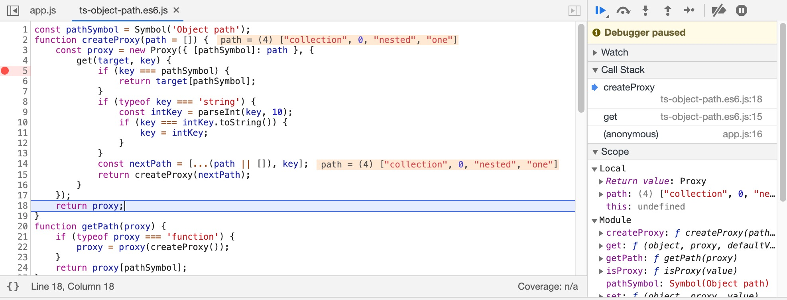
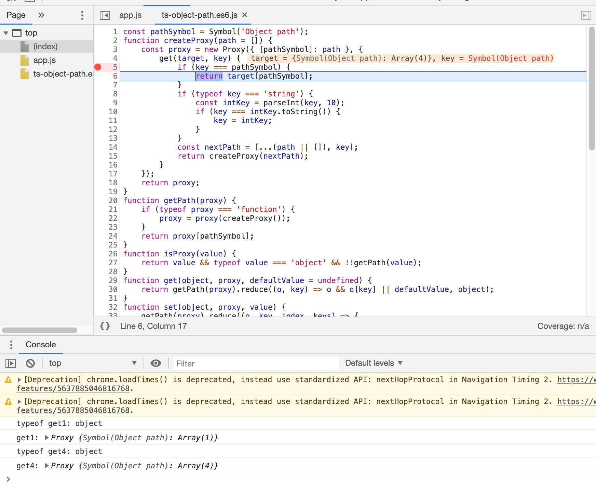

## Prepare test files
checkout https://github.com/Taras-Tymchiy/ts-object-path

change the compile option target to `es6`. run build.

copy the generated js file, which we have already done.


## JS explain

The JS part and TS part could be analysed seperately

### Decomposition
As show in `app.js` file, an property accessor such as `p.collection[0].nested.one` can be decomposed into :

```js
const get1 = p.collection;
const get2 = get1[0];
const get3 = get2.nested;
const get4 = get3.one;
```

By inspecting each step, we know that every `get<k>` will return an `Proxy` object.


### Step by step
The syntax aspect is recursive. First time we call `createProxy()`, we get a Proxy instance such that when this proxy object `p` in future gets *key-accessed* by an expression such as `p.collection`, it will recursively call `createProxy()` and then return another proxy instance. The crucial part is that we get a "side effect" by leveraging the closure created by `createProxy(path)` call. **The side effect is actually to concatenate key with previous keys then "remember" the "path"**.




Note that all these are done before calling the next accessor `[0]`. So each prop accessor operation are not interlaced. This helps a lot with understanding the whole process.


The final proxy object is `get4`. `get<k>` is such an proxy object that when got accessed by an special key `pathSymbol`, it will return the path remembered and done.


Therefore, `get4`, when accessed by `pathSymbol` in the `getPath` call, finally returns the whole path `[ "collection", 0, "nested", "one"]`.



## TS explained
When called with type such as
```ts
interface IExample {
  one: number;
  two: string;
  nested: IExample;
  collection: IExample[];
}

createProxy<IExample>
```

The return instance is of ts type

```ts
ObjPathProxy<IExample, T>
```

which is
```ts
{
  [P in keyof T]: ObjPathProxy<IExample, T[P]>;
}
```

```
p.collection[0].nested.one
```

every time prop gets accessed, **the return type's key** is strongly typed, not the return type. This is enough for typing the path. For runtime, This is also ok because the runtime correctness is guaranteed by js but not ts.

for example,

`p.collection` will get type `ObjPathProxy<IExample, collection>`, which is an `Array<IExample>`, so that we can continue to access by `[0]`


